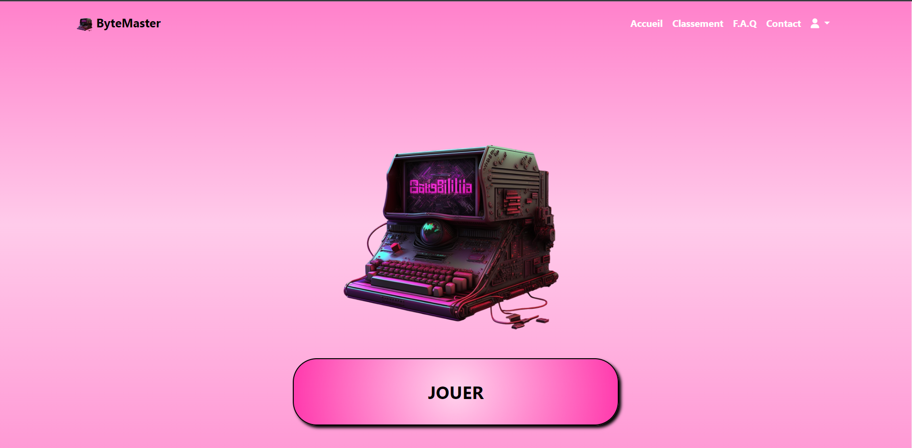

## ByteMaster

Ce projet est actuellement en cours de développement !

Bienvenue sur notre projet !

## ByteMaster

Description succincte du projet réalisé en utilisant les technologies HTML, CSS, JavaScript et PHP avec une architecture MVC.

<a href="http://bytemaster.alwaysdata.net/" target="_blank">**Voir en ligne** 🚀</a>

## 📌 Aperçu du projet 🙈 :

Notre projet est le fruit d'une collaboration passionnante et d'un travail d'équipe. Nous avons mis tout notre savoir-faire et notre créativité pour développer une solution innovante qui répond à vos besoins. Que vous soyez un développeur chevronné ou un débutant curieux, notre projet est conçu pour vous faciliter la vie et vous offrir une expérience exceptionnelle.

Qu'est-ce qui rend notre projet unique ? Nous avons mis l'accent sur la simplicité, la flexibilité et la convivialité. Nous avons veillé à ce que chaque ligne de code soit optimisée, chaque fonctionnalité soigneusement pensée et chaque aspect du projet parfaitement exécuté. Nous avons travaillé dur pour créer une interface intuitive et agréable à utiliser, tout en offrant une multitude de fonctionnalités puissantes pour répondre à vos besoins les plus spécifiques.

Que vous souhaitiez collaborer avec d'autres développeurs, gérer des projets complexes ou simplement explorer de nouvelles technologies, notre projet est là pour vous accompagner. Nous croyons en l'importance de la communauté et de l'open source, c'est pourquoi nous avons rendu notre projet accessible à tous. Nous encourageons les contributions, les suggestions et les idées novatrices qui feront évoluer notre projet vers de nouveaux horizons.

Nous sommes fiers de vous présenter notre travail et nous espérons qu'il vous sera utile et inspirant. N'hésitez pas à explorer notre documentation complète, à essayer notre projet et à partager vos retours avec nous. Votre satisfaction est notre plus grande récompense.

Rejoignez-nous dans cette aventure passionnante et découvrez comment notre projet peut changer votre façon de développer et d'innover. Ensemble, nous pouvons repousser les limites et construire un avenir meilleur.

Bienvenue dans notre projet, bienvenue sur ByteMaster.

© 2023

 by 
<a href="https://serbelloni.vercel.app/">Alexis<a> | <a
            href="https://soussignan.netlify.app/">Mathieu<a> | <a href="https://rusescu-alexandru.netlify.app/">Alex<a>
| <a href="https://github.com/4hm3dx">Ahmed<a> 

